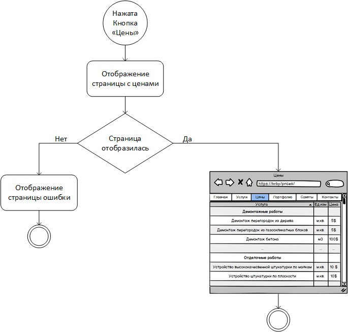

# Диаграммы состояния
---
Данные диаграммы были построены с использованием mockups
# Содержание
1 [Просмотр услуг](#check_service)  
2 [Просмотр цен](#check_prices)  
3 [Просмотр портфолио](#check_portfolio)

<a name="check_service"/>

# 1 Просмотр услуг

<a name="check_prices"/>

# 2 Просмотр цен

<a name="check_portfolio"/>

# 3 Просмотр портфолио
