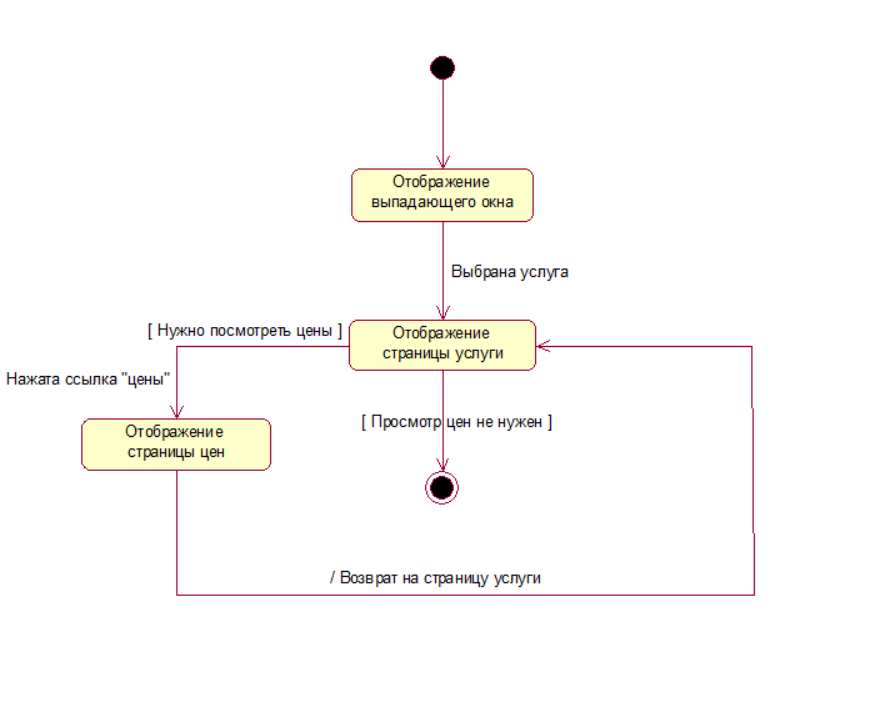
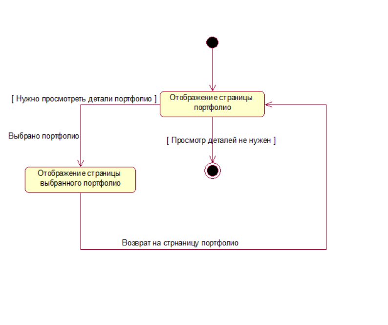

# Диаграммы состояния
---
Данные диаграммы были построены с использованием mockups
# Содержание
1 [Просмотр услуг и цен на услуги](#check_service)    
2 [Просмотр портфолио](#check_portfolio)

<a name="check_service"/>

# 1 Просмотр услуг и цен на услуги
Страницы можно посмотреть по ссылкам:   
1) [Страница услуги](../../../pictures/mockups/services_details.png)   
2) [Страница цен](../../../pictures/mockups/prices.png)

<a name="check_portfolio"/>

# 2 Просмотр портфолио
Страницы можно посмотреть по ссылкам: 
1) [Страница портфолио](../../../pictures/mockups/portfolio.png)   
2) [Страница деталей портфолио](../../../pictures/mockups/portfolio_details.png)

