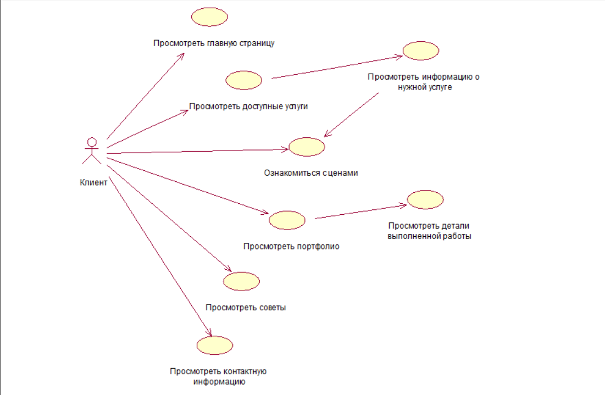

# Диаграмма вариантов использования

Сценарии для каждого варианта использования описаны в [файле случаев событий](useCase.md).

Ключевые понятия, используемые в диаграмме вариантов использования, отражены в [глоссарии](glossarium.md).
