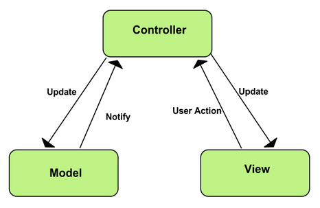
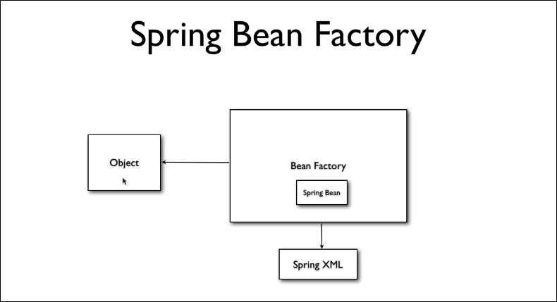

# Обзор паттернов использованных при реализации проекта
---

# 1 Singleton
Данный паттерн очень популярен при разработке ПО, особенно в фреймворках, использующих Inversion of Control. Механизм Dependency Injection (для данного проекта это механизм в Spring Framework и Angular Framework) манипулирует бинами и выполняет их внедрение при обращении из различных классов. В данном проекте, используя scope бинов, реализован данный паттерн (все бины являются синглтонами).

# 2 MVC
Паттерн Model View Controller является основопологающим при разработке многих проектов. Идея состоит в разделении данных, UI и управляющей логики. Для данного проекта используются аннотации @RestController, @Entity, @Service для указания к какому блоку относится данный бин.

# 3 Factory
Паттерн Factory применяется при инициализации бинов приложения. Для данного проекта при инициализации бинов используется класс BeanFactory. При инициализации SpringContext вызывается метод getBean, который создает бин в соответствии с xml конфигурацией (для данного проекта вместо xml используются java аннотации).

