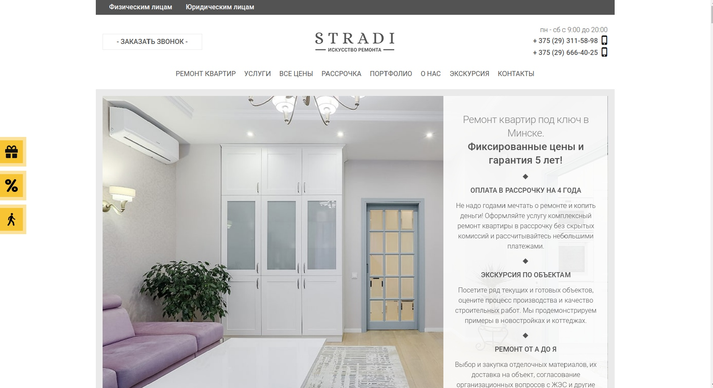

# Обзор аналогов
---

# Содержание 
1 [Обзор приложений](#application_overview)  
1.1 [Remont-remont](#remont_remont)  
1.2 [Atelit](#atelit)  
1.3 [Stradi](#stradi)  
2 [Сравнение приложений](#comparison_of_applications)

<a name="application_overview"/>

# 1 Обзор приложений

<a name="remont_remont"/>

## 1.1 Remont-remont
**Дизайн интерьера:** есть  
**Полный спектр услуг:** нет

Главная страница remont-remont.

  

Remont-remont – популярный ресурс, предоставляющий ремонтные и строительные услуги.
Предоставляемые услуги:
* дизайн интерьера;
* ремонт "под ключ";
* предприемка новостроек.

<a name="atelit"/>

## 1.2 Atelit
**Дизайн интерьера:** есть   
**Полный спектр услуг:** нет

Главная страница atelit.

  

Atelit – популярный ресурс, предоставляющий ремонтные и строительные услуги.
Предоставляемые услуги:
* дизайн домов и коттеджей;
* дизайн интерьера квартир;
* ремонт квартир и домов "под ключ".

<a name="stradi"/>

## 1.3 Stradi
**Дизайн интерьера:** нет  
**Полный спектр услуг:** нет

Главная страница stradi.

  

Stradi – популярный ресурс, предоставляющий ремонтные и строительные услуги.
Предоставляемые услуги:
* отделка квартир;
* ремонт в новостройках;
* ремонт коттеджей и домов;
* ремонт офисов;
* перепланировка квартир;
* приемка квартир.

<a name="comparison_of_applications"/>

# 2 Сравнение приложений

| Услуга |  Remont-remont | Atelit | Stradi |
|:---|:---:|:---:|:---:|
| Дизайн интерьера | + | + | - |
| Ремонт квартир | + | + | + |
| Предприемка новостроек | + | - | + |
| Портфолио мастеров | - | + | + |
| Полный спектр услуг | - | - | - |
