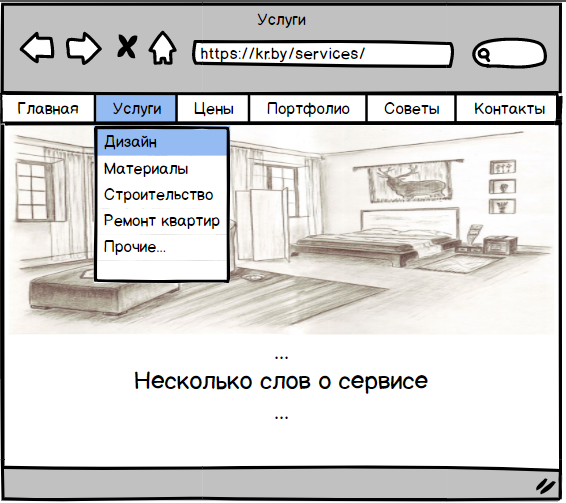

# Требования к проекту
---

# Содержание
1 [Введение](#intro)  
1.1 [Назначение](#appointment)  
1.2 [Бизнес-требования](#business_requirements)  
1.2.1 [Исходные данные](#initial_data)  
1.2.2 [Возможности бизнеса](#business_opportunities)  
1.2.3 [Границы проекта](#project_boundary)  
1.3 [Аналоги](#analogues)  
2 [Требования пользователя](#user_requirements)  
2.1 [Программные интерфейсы](#software_interfaces)  
2.2 [Интерфейс пользователя](#user_interface)  
2.3 [Характеристики пользователей](#user_specifications)  
2.3.1 [Классы пользователей](#user_classes)  
2.3.2 [Аудитория приложения](#application_audience)  
2.3.2.1 [Целевая аудитория](#target_audience)  
2.3.2.1 [Побочная аудитория](#collateral_audience)  
2.4 [Предположения и зависимости](#assumptions_and_dependencies)  
3 [Системные требования](#system_requirements)  
3.1 [Функциональные требования](#functional_requirements)  
3.1.1 [Основные функции](#main_functions)  
3.1.1.1 [Выбор услуг](#choose_services)  
3.1.1.2 [Просмотр портфолио](#check_portfolio)  
3.1.1.3 [Заказ обратного звонка](#callback_order)  
3.1.2 [Ограничения и исключения](#restrictions_and_exclusions)  
3.2 [Нефункциональные требования](#non-functional_requirements)  
3.2.1 [Атрибуты качества](#quality_attributes)  
3.2.1.1 [Требования к удобству использования](#requirements_for_ease_of_use)  
3.2.1.2 [Требования к безопасности](#security_requirements)  
3.2.1.3 [Требования к удобству сопровождения](#maintainability_requirements)  
3.2.2 [Внешние интерфейсы](#external_interfaces)  
3.2.3 [Ограничения](#restrictions)  

<a name="intro"/>

# 1 Введение

<a name="appointment"/>

## 1.1 Назначение
В этом документе описаны функциональные и нефункциональные требования к веб-приложению "КР - Капитальный Ремонт". Этот документ предназначен для команды разработчиков, которая будет реализовывать и следить за правильностью разработки приложения. 

<a name="business_requirements"/>

## 1.2 Бизнес-требования

<a name="initial_data"/>

### 1.2.1 Исходные данные
Большинству людей в своей жизни рано или поздно приходится сталкиваться лицом к лицу с ремонтом. Ремонт может быть любой: от банального переклеивания обоев, до смены обстановки квартиры или даже полноценной постройки дома с нуля. Но далеко не у каждого есть необходимые знания или возможности для реализации задуманного, и поэтому многие люди обращаются за помощью к профессионалам. Они начинают тщательно и скрупулезно подбирать дизайнеров, строителей, электриков, сантехников и многих других, ведь всем нужно, чтобы работа была выполнена качественно и в короткие сроки. Есть огромное количество сервисов, предоставляющих услуги в каждой из областей отдельно, но очень мало сервисов, которые могли бы предоставить комплексную помощь во всех необходимых пользователю сферах строительства и ремонта, от выбора обоев, до полноценной постройки целого дома. И если искать все нужное отдельно, то этот подбор необходимых материалов, рабочих, создание дизайна своего будущего интерьера и экстерьера помещения могут стать настоящей головной болью для людей, не имеющих никаких знаний в области строительства или ремонта.

<a name="business_opportunities"/>

### 1.2.2 Возможности бизнеса
Люди, столкнувшиеся с необходимостью проведения ремонта или строительства, желают обратиться в какой-либо сервис и получить ответы на все интересующие их вопросы, избежав тем самым проблем и недопонимания при самостоятельном поиске информации. Именно для этого и предназначен проект "КР - Капитальный Ремонт". Подобное приложение облегчит людям проведение ремонта и сделает его не только быстрым, но и увлекательным. Приложение будет предоставлять возможность для пользователя выбрать нужную услугу и проконсультироваться с профессионалом в этой области, а также заказать выполнение данной услуги. Для, тех пользователей, которые не планируют заказывать услуги профессиональных рабочих в данный момент, будет существовать раздел с советами по проведению ремонта от сотрудников сервиса, а также от простых людей, переживших ремонт, которые делятся своими рекомендациями и разнообразными ошибками, которые они допустили в процессе. Отличный сервис с большим количеством услуг, которые могут удовлетворить потребности каждого, и способный облегчить жизнь многим людям, привлечет большое количество пользователей, нуждающихся в ремонте или стройке.

<a name="project_boundary"/>

### 1.2.3 Границы проекта
Приложение "КР - Капитальный ремонт" будет доступно всем пользователям. Для заказа услуги пользователь может позвонить по указанным номерам или заказать звонок.

<a name="analogues"/>

## 1.3 Аналоги
Обзор аналогов представлен в документе [Review Analogues](Review%20Analogues.md).

<a name="user_requirements"/>

# 2 Требования пользователя

<a name="software_interfaces"/>

## 2.1 Программные интерфейсы
1. Приложение будет реализовано на Spring Framework.
2. Для хранения данных будет использована свободная реляционная система управления базами данных MySQL.
3. Разработка будет проводиться в интегрированной среде разработки Intellij Idea.

<a name="user_interface"/>

## 2.2 Интерфейс пользователя
Главная страница.  
  
Окно услуг.  
  
Окно отображения цен на услуги.  
  
Окно портфолио работников сервиса.  
  
Окно с полезными советами для всех пользователей.  
  
Окно контактов сервиса.  
  

<a name="user_specifications"/>

## 2.3 Характеристики пользователей

<a name="user_classes"/>

### 2.3.1 Классы пользователей

Все пользователи сервиса имеют одинаковые условия и возможности.

<a name="application_audience"/>

### 2.3.2 Аудитория приложения

<a name="target_audience"/>

#### 2.3.2.1 Целевая аудитория
Люди среднего возраста, нуждающиеся в ремонте или постройке домов, квартир и др.

<a name="collateral_audience"/>

#### 2.3.2.2 Побочная аудитория
Люди других возрастных категорий, обладающие вышеперечисленными качествами.

<a name="assumptions_and_dependencies"/>

## 2.4 Предположения и зависимости
Приложение не работает при отсутствии подключения к Интернету.

<a name="system_requirements"/>

# 3 Системные требования

<a name="functional_requirements"/>

## 3.1 Функциональные требования

<a name="main_functions"/>

### 3.1.1 Основные функции

<a name="choose_services"/>

#### 3.1.1.1 Выбор услуг
**Описание.** Пользователь имеет возможность найти нужную ему услугу, выбрать мастера или нажать на кнопку "любой мастер".

| Функция | Требования | 
|:---|:---|
| Открытие деталей услуги | Приложение должно предоставить возможность детального рассмотрения выбранной услуги |
| Выбор мастера | Приложение должно предоставить пользователю возможность выбирать понравившегося мастера (работника) |

<a name="check_portfolio"/>

#### 3.1.1.2 Просмотр портфолио
**Описание.** Пользователь имеет возможность просмотреть портфолио всех мастеров (работников) сервиса.
 
| Функция | Требования | 
|:---|:---|
| Открытие страницы portfolio | Приложение должно выводить краткую информацию про каждого мастера |
| Открытие подробной информации | Приложение должно при нажатии на любое портфолио открывать страницу с подробной информацией о выбранном мастере |

<a name="callback_order"/>

#### 3.1.1.3 Заказ обратного звонка
**Описание.** Приложение должно предоставлять пользователю возможность заказа обратного звонка для обсуждения интересующих его вопросов.

**Требование.** При заказе пользователем обратного звонка должна приходить об этом информация, чтобы первый освободившийся оператор смог перезвонить потенциальному заказчику. 

<a name="restrictions_and_exclusions"/>

### 3.1.2 Ограничения и исключения
Приложение работает только при наличии подключения к Интернету;

<a name="non-functional_requirements"/>

## 3.2 Нефункциональные требования

<a name="quality_attributes"/>

### 3.2.1 Атрибуты качества

<a name="requirements_for_ease_of_use"/>

#### 3.2.1.1 Требования к удобству использования
1. Соответствие стандартам;
2. Все функциональные элементы пользовательского интерфейса имеют названия, описывающие действие, которое произойдет при выборе элемента;
3. Понятный пользователям интерфейс;
4. Привлекательность;
5. Ре-активность - подразумевает короткое время отклика программы. Пользователь должен быть удовлетворен работой программы.

<a name="security_requirements"/>

#### 3.2.1.2 Требования к безопасности
1. Способность к восстановлению информации;
2. Приложение доступно всем пользователям, независимо от того, зарегистрированы они или нет.

<a name="maintainability_requirements"/>

#### 3.2.1.3 Требования к удобству сопровождения
1. Удобство изменений;
2. Соответствие стандартам;
3. Анализируемость;
4. Стабильность.

<a name="external_interfaces"/>

### 3.2.2 Внешние интерфейсы
Окна приложения понятны пользователям, отображают всю необходимую информацию:
  * фотографии выполненых работ отображаются на главной странице;
  * функциональные элементы контрастны фону окна.

<a name="restrictions"/>

### 3.2.3 Ограничения
1. Приложение реализовано на Spring Framework.
2. Для хранения данных использовать реляционную систему управления базами данных MySQL.
